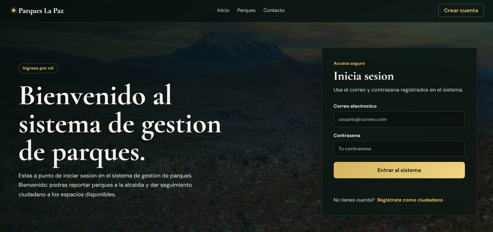
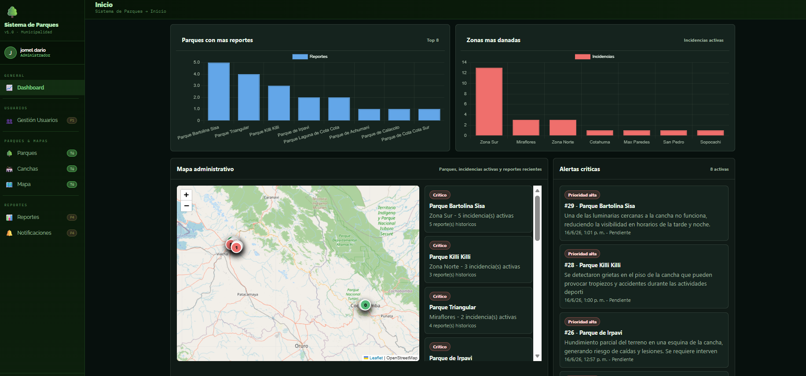
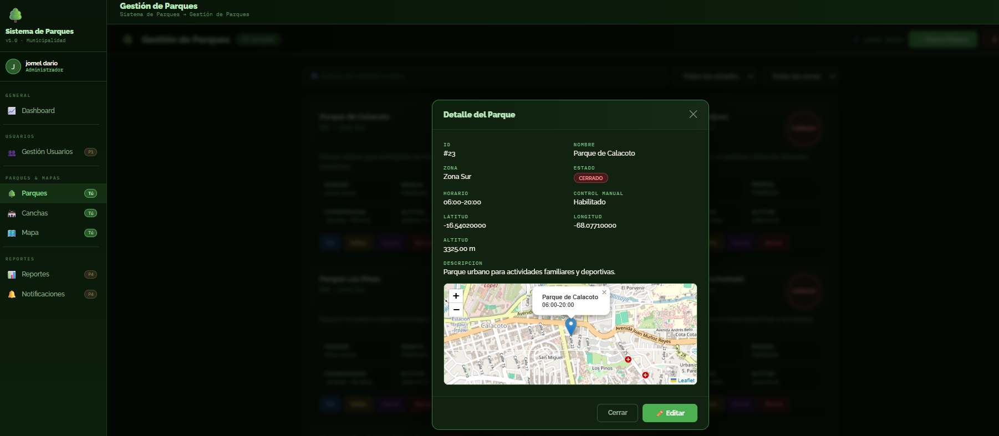
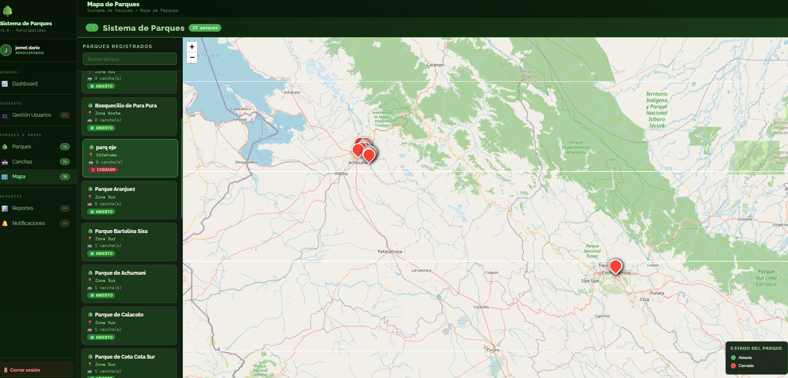
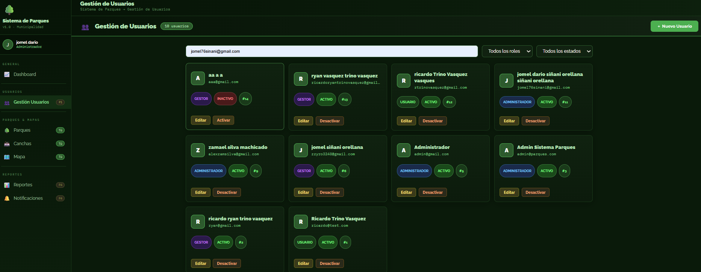
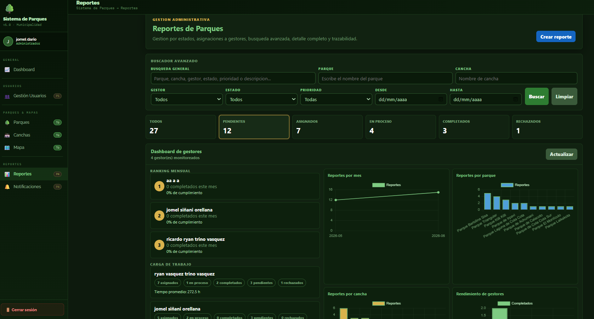
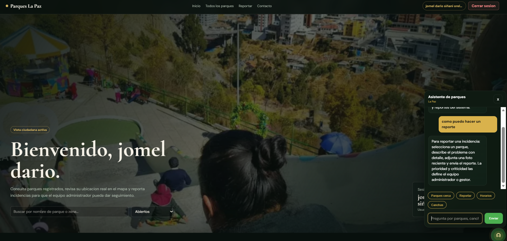

# 🏞️ Park Management System

A complete web application for managing public parks, users, zones, reports, and administrative processes. The system includes role-based authentication, real-time communication, PDF report generation, and a modular architecture built with Node.js and Express.

---

## Overview

The Park Management System was developed to simplify the administration of public parks by providing tools for managing parks, zones, users, reports, and other administrative tasks through a secure and scalable web application.

---

## Features

- Secure authentication and authorization
- Role-based access control
- Park management
- Zone management
- User management
- Dashboard with statistics
- PDF report generation
- Integrated chatbot
- Real-time communication with Socket.IO
- MySQL database integration
- Modular project architecture

---

# Technologies

| Technology | Description |
|------------|-------------|
| Node.js | Backend runtime |
| Express.js | Web framework |
| MySQL | Relational database |
| Socket.IO | Real-time communication |
| JavaScript | Programming language |
| HTML5 | Frontend |
| CSS3 | Styling |
| Bootstrap | User Interface |
| JWT | Authentication |
| Nodemon | Development server |

---

# Application Preview

## Login



---

## Dashboard



---

## Park Management



---

## Zone Management



---

## User Management



---

## Reports



---

## Chatbot



---

# Project Structure

```
park-management-system
│
├── database/
├── docs/
├── public/
├── screenshots/
├── src/
│
├── .env.example
├── package.json
├── package-lock.json
├── index.html
└── README.md
```

---

# Authentication

The application implements secure authentication using:

- Login system
- Role-based authorization
- Middleware protection
- Session validation

---

# Database

The project uses **MySQL** as the primary relational database.

Main modules include:

- Users
- Parks
- Zones
- Reports

---

# Installation

Clone the repository

```bash
git clone https://github.com/jomel42/park-management-system.git
```

Go to the project folder

```bash
cd park-management-system
```

Install dependencies

```bash
npm install
```

Configure environment variables

```bash
cp .env.example .env
```

Run the project

```bash
npm run dev
```

---

# License

This project is licensed under the MIT License.

---

## Author

**Jomel Dario Sinani Orellana**

GitHub:

https://github.com/jomel42
